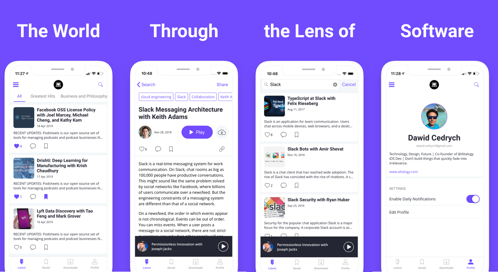

# Software Engineering Daily iOS App

[](https://softwareengineeringdaily.com/)

Native iOS app for [Software Engineering Daily](https://softwareengineeringdaily.com/).

## Screenshots



## Getting Started

The app is 100% Swift. User interface is built mostly in code using [SnapKit](https://github.com/SnapKit/SnapKit) DSL. The current architecture is MVVM-C, but moving forward we are open to consider some Redux-like state management implementation.

## Setup

We are using [CocoaPods](http://cocoapods.org) to manage dependencies.
Clone the repo and then run:

```
$ sudo gem install cocoapods
$ pod install
```

CocoaPods requires that you open the *SEDaily-IOS.xcworkspace*.

```
$ open SEDaily-IOS.xcworkspace
```

## Dependencies

There are +25 various dependencies used in the project. Moving forward some of them may be subject to change/removal. 
The most important ones are:

* [SnapKit](https://github.com/SnapKit/SnapKit) - Build layouts in code.
* [Alamofire](https://github.com/Alamofire/Alamofire) - Industry standard for networking.
* [Kingfisher](https://github.com/onevcat/Kingfisher) - Caching images.
* [SwiftLint](https://github.com/realm/SwiftLint) - Swift language linter.


## Upcoming features

Interested in seeing a particular feature implemented in this app? Please open a new [issue](https://github.com/SoftwareEngineeringDaily/se-daily-iOS/issues) with a [feature proposal](https://github.com/SoftwareEngineeringDaily/se-daily-iOS/blob/master/CONTRIBUTING.md#feature-proposals).

Contributing
------------
Checkout [CONTRIBUTING.md](https://github.com/SoftwareEngineeringDaily/se-daily-iOS/blob/master/CONTRIBUTING.md) for details.

